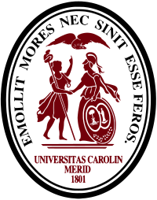
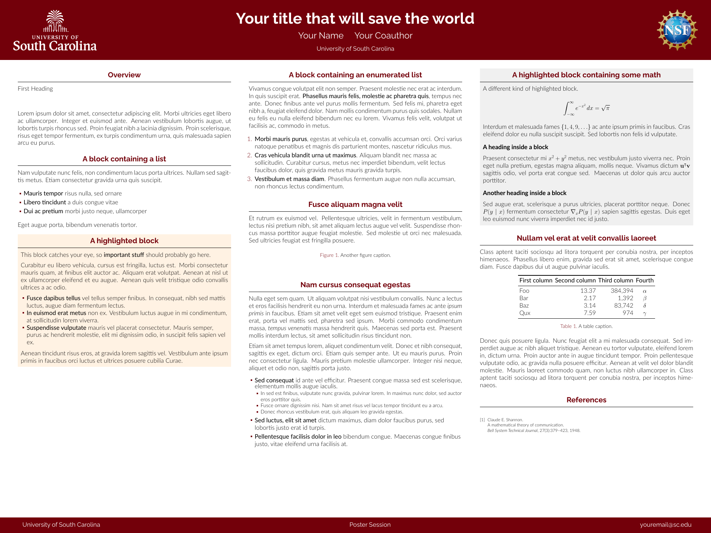

<div align="center">



# Unofficial University of South Carolina Research Poster Template


</div>

A LaTeX [beamerposter] template in USC branding, based on the [Gemini] theme.

<p align="center">
<a href="poster.pdf">

</a>
</p>

## Files

| File | Purpose |
| --- | --- |
| `poster.tex` | The poster: title, authors, footer, content blocks |
| `beamercolorthemeusc.sty` | USC colors |
| `beamerthemegemini.sty` | Gemini layout theme |
| `logos/` | White USC logo and NSF logo |
| `poster.bib` | Bibliography |
| `.latexmkrc` | Selects LuaLaTeX for latexmk |

## Requirements

A **full** TeX Live 2024 or newer: it includes LuaLaTeX and `latexmk` (both
required; the theme's `fontspec` breaks pdflatex) and the Raleway/Lato fonts.

- **macOS:** [MacTeX] (`brew install --cask mactex`)
- **Windows:** [TeX Live] (full scheme)
- **Linux:** `texlive-full`

Or skip installing entirely and use [Overleaf](#use-on-overleaf).

## Build

```sh
latexmk poster.tex
```

## Use on Overleaf

Upload the repo ZIP as a new project and set the compiler to **LuaLaTeX**.
This GitHub repo is the canonical version.

## Customizing

- **Title, authors, footer:** top of `poster.tex`.
- **Size:** preset to 48in x 36in landscape (set in cm).
- **Colors:** `beamercolorthemeusc.sty`, using the official [USC brand colors].
- **Logos:** in the header via `\logoleft` and `\logoright` (drop the NSF
  logo if not NSF-funded); more variants in the [USC toolbox][USC logos].
- **Printing:** print from the PDF, and confirm the board size with your event.

## License

MIT (see [LICENSE.md](LICENSE.md)). Unofficial; not endorsed by the
University of South Carolina. Logos remain subject to USC brand guidelines.

[beamerposter]: https://github.com/deselaers/latex-beamerposter
[Gemini]: https://github.com/anishathalye/gemini
[MacTeX]: https://www.tug.org/mactex/
[TeX Live]: https://www.tug.org/texlive/
[USC brand colors]: https://sc.edu/about/offices_and_divisions/communications/toolbox/colors/
[USC logos]: https://sc.edu/about/offices_and_divisions/communications/toolbox/logos/
